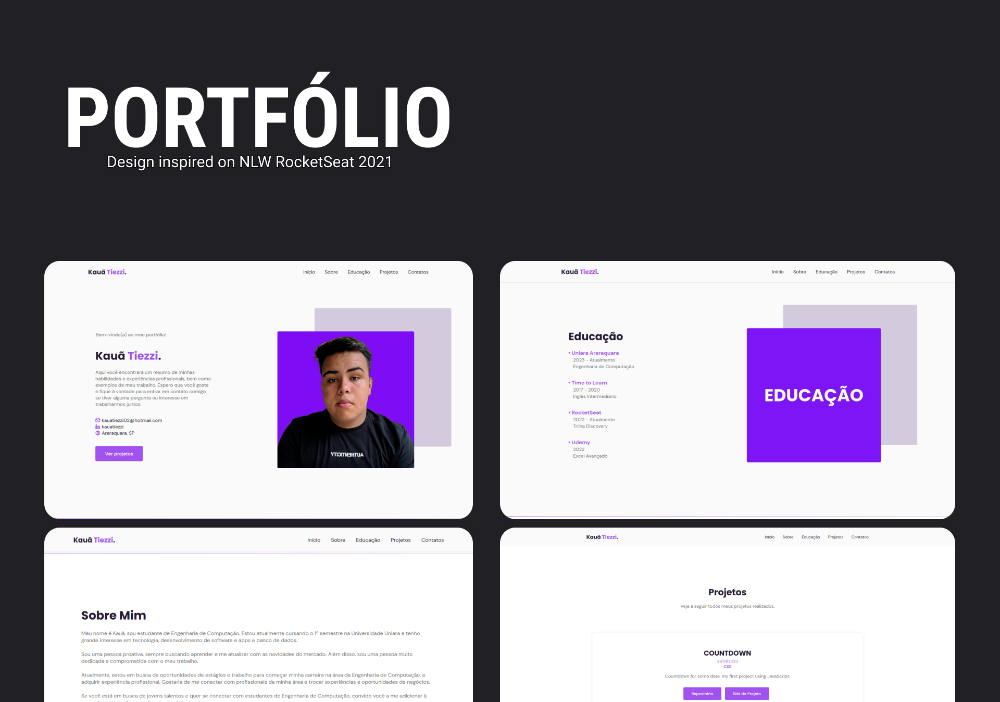

<h1 align="center"> PORTFÓLIO </h1>

Projeto desenvolvido para meu portfólio pessoal, utilizando a GITHUB API com JavaScript. Esse design me inspirei em uma NLW Setup da RocketSeat de 2021. Esse projeto apresenta um site responsivel para PC/TABLET/CELULAR onde cada vez irei mais aprimorando essas versões. Gostei demais de realizar esse projeto pois aprendi muito, principalmente usar API como a do Github que foi usada aqui.  

  <a href="#-tecnologias">Tecnologias</a>&nbsp;&nbsp;&nbsp;|&nbsp;&nbsp;&nbsp;
  <a href="#-projeto">Projeto</a>
  

  

 

  

## 🚀 Tecnologias

Esse projeto foi desenvolvido com as seguintes tecnologias:

- HTML e CSS
- JavaScript
- API (GITHUB)
- Git e Github
- Figma

## 💻 Projeto

Projeto do meu portfólio pessoal utilizando a API do Github, além de um belo desenvolvimento para minha marca pessoal, também para meu aprendizado.

- [Acesse o projeto finalizado, online.](https://kauatiezzi.github.io/Portfolio/)

---

Feito com ♥ by Kauã Tiezzi [Entre em contato comigo clicando aqui.](https://discord.gg/ARxrzArWsA)
